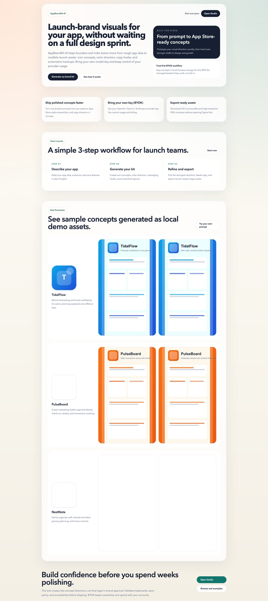
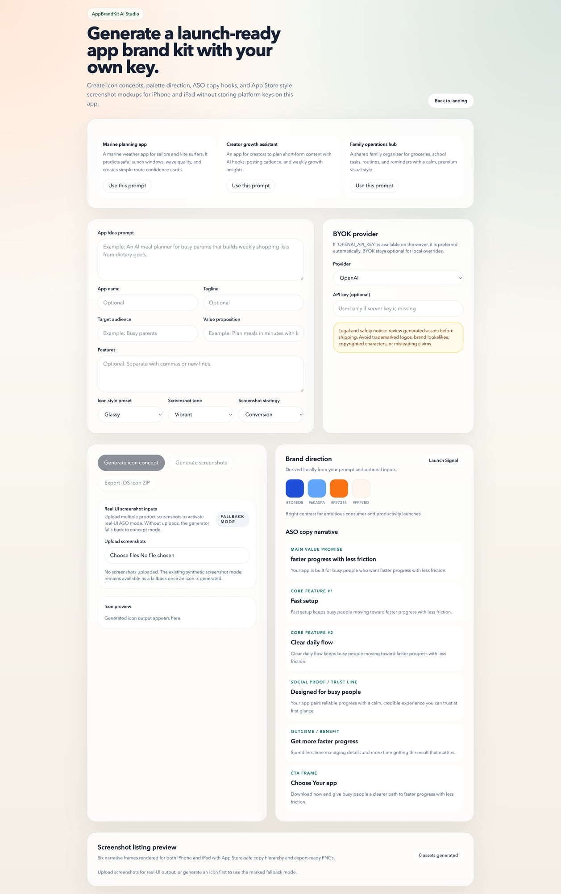

# AppBrandKit AI

Open-source MVP web app for turning an app idea into a starter brand kit with BYOK AI providers.

## Live demo

- https://appbrandkit-ai.vercel.app/

## Stack

- Next.js App Router
- TypeScript
- Tailwind CSS
- `sharp` + `jszip` for icon export
- Canvas for screenshot mockups

## Setup

```bash
npm install
npm run dev
```

Open `http://localhost:3000`.

## Secure local OpenAI key (recommended on macOS)

Instead of storing keys in plaintext `.env.local`, run development with a Keychain-backed key:

1. Add your key once to macOS Keychain:

```bash
security add-generic-password -U \
  -s "appbrandkit-openai-api-key" \
  -a "alexis" \
  -w "sk-..."
```

2. Start the app with Keychain injection:

```bash
npm run dev:keychain
```

This runs `scripts/dev-with-keychain.sh`, which reads the key from Keychain, exports `OPENAI_API_KEY` only for that process, and starts `next dev`.

## Scripts

- `npm run dev`
- `npm run dev:keychain` (macOS Keychain-backed local key flow)
- `npm run build`
- `npm run start`
- `npm run lint`
- `npm test` (smoke tests for narrative + export preconditions)

## Key handling model

- Server-side `OPENAI_API_KEY` is preferred automatically when present.
- BYOK key input remains available but optional, and is only used when no server key exists.
- BYOK provider/key preferences are still stored in `localStorage` for local MVP convenience.

## Screenshots

### Landing



### Studio



## Trust & privacy (BYOK)

- You can run with your own provider key (BYOK) so usage/cost stays under your account.
- For local macOS dev, use Keychain-backed startup (`npm run dev:keychain`) instead of plaintext keys.
- Server-side `OPENAI_API_KEY` (when present) is preferred over browser input.
- Browser key input is optional fallback for local MVP convenience and is stored locally in `localStorage`.
- Never share production keys publicly; use scoped/revocable keys and rotate if exposed.

## Visual output upgrades

- **Icons:** stronger prompt engineering for iOS icon quality with explicit constraints (centered symbol, bold shape language, vivid gradients, high contrast, minimal clutter, no text/watermarks).
- **Icon style presets:** Glassy, Flat Bold, 3D Soft.
- **Screenshots:** upgraded App Store-style renderer with cleaner hierarchy, stronger headline/supporting copy, gradient cards, safe framing, icon badge, and feature chips.
- **Templates:** 6 screenshot templates (each exported for iPhone + iPad).
- **Studio UX:** screenshot tone control (Minimal, Vibrant, Premium) and listing-like preview strip.

## What Works Now

- Landing page at `/`
- Studio at `/studio`
- Help center at `/help` (quick start, trust/safety, troubleshooting, FAQ)
- Provider abstraction with OpenAI, Gemini, and Anthropic options
- Real OpenAI image generation path for app icon concepts
- Local brand palette and marketing copy suggestions derived heuristically from the prompt
- Screenshot mockup generation with 6 templates for both iPhone and iPad outputs
- PNG export for generated icon and screenshot mockups
- iOS icon ZIP export containing common app icon sizes
- Legal, trademark, and safety disclaimers in the UI

## Stubbed / Not Yet Implemented

- Gemini image generation
- Anthropic image generation
- Persistent project history
- Auth, teams, hosted key management, and production-safe secret handling
- Rich editing controls for template text/layout

## Troubleshooting

- Icon ZIP requires a generated data URL icon.
- Screenshots ZIP requires generated screenshot frames.
- Full bundle requires at least one generated artifact (icon or screenshots).
- If BYOK state is stale, clear local BYOK cache in Studio and refresh.
- Uploads accept PNG/JPEG/WEBP (up to 8MB each).

## Notes

- OpenAI image generation requires a valid API key (server env key or optional BYOK fallback) and network access from the server route.
- The icon ZIP export currently expects a generated data URL image; remote URL-only outputs are previewable but not zipped.
- Review all generated assets before commercial use.
